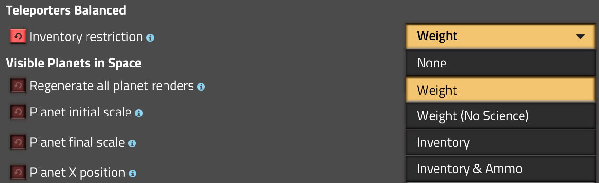
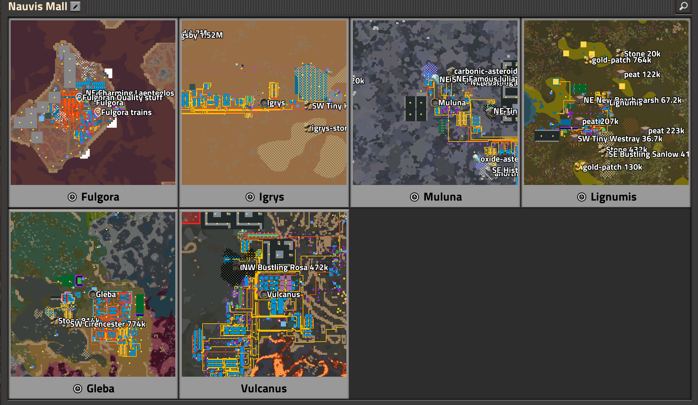

## Teleporters

--------------------------------------

Based on https://github.com/Klonan/Teleporters.

This mod adds teleporters you can stand on, and teleport around the world and between surfaces with. It has new balance options for Space Age.
The following mod options are available:
Startup Mods:
- Teleporters Planet Lock: Teleportation between different planets requires researching a technology that uses science packs from that planet.
- Teleporters Aquilo Science: Teleportation research also requires Aquilo science packs.
- Teleporters Same Surface Only: Teleporters only show other teleporters on the same surface.

Map Mods:
- Teleporters Inventory Restriction: Restricts items that can be transported during teleportation.

Note that when switching from the original Teleporters mod to this mod, you may need to remove and replace each teleporter.

